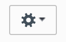
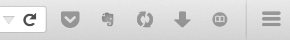
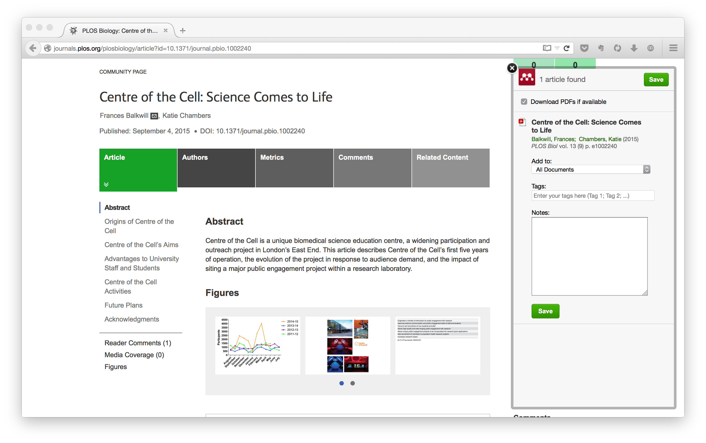

# Unofficial Mendeley Importer for Firefox
A firefox addon that calls the Mendeley importer to cite the current page. Click the icon and the Mendeley import box will open.

# To install

*This add-on is currently unavailable from the mendeley add-on catalogue. Currently it must be installed manually.*

1. Make sure your Firefox browser is setup to use unverified add-ons. Some newer versions are not setup like this by default (even developer editions)
  1. Load about:config in Firefox's address bar and hit enter.
  2. Confirm you will be careful if a warning message is displayed.
  3. Search for `xpinstall.signatures.required`.
  4. Double-click on the preference name so that its value is set to false.

2. Download `@mendeley-X.X.X.xpi`. There are two methods.
  - **Easy**: Drag the file onto your firefox window,
  - **Hard**: Install the xpi file. Open Firefox and go to `Tools`>`Addons`>>`install add on from file` then navigate to your download location and select the `@mendeley-X.X.X.xpi` file.

# About
Calls the Mendeley importer (maintained by [Mendeley](http://blog.mendeley.com/research-tutorials/mendeleys-one-click-web-importer/)) to cite the current page. This is primarily for academic web pages that are often behind paywalls. A good open access journal article to test is [PLoS](http://journals.plos.org/plosbiology/article?id=10.1371/journal.pbio.1002240).

[Icon source](https://commons.wikimedia.org/wiki/File:Book_icon_%28white_on_black%29.svg).

## Screenshots
The icon on the right of the add-on bar alongside pocket, Evernote, sync, and downloads:

The opened dialogue is called from Mendeley directly, so should work anywhere the bookmark would.

